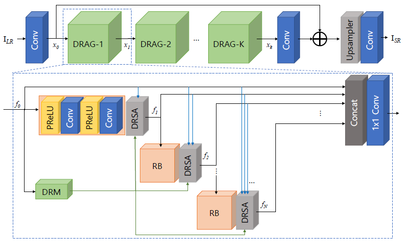
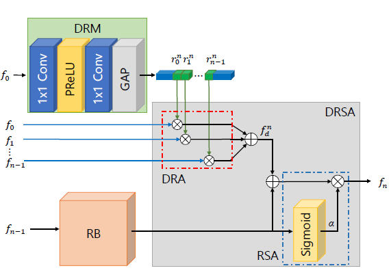
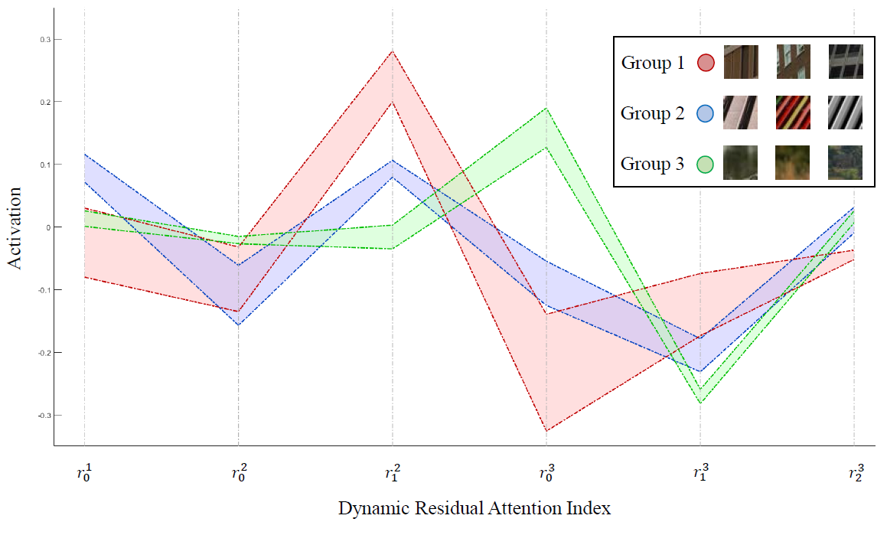
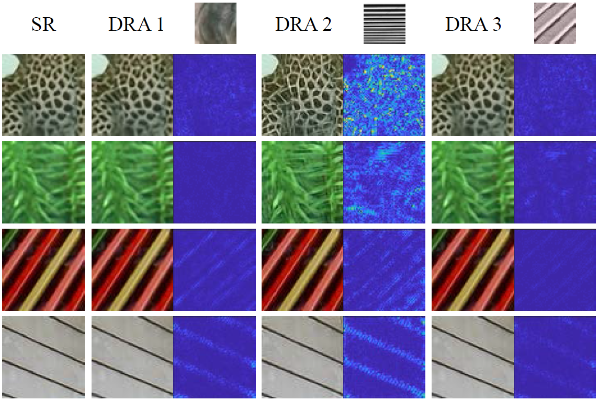
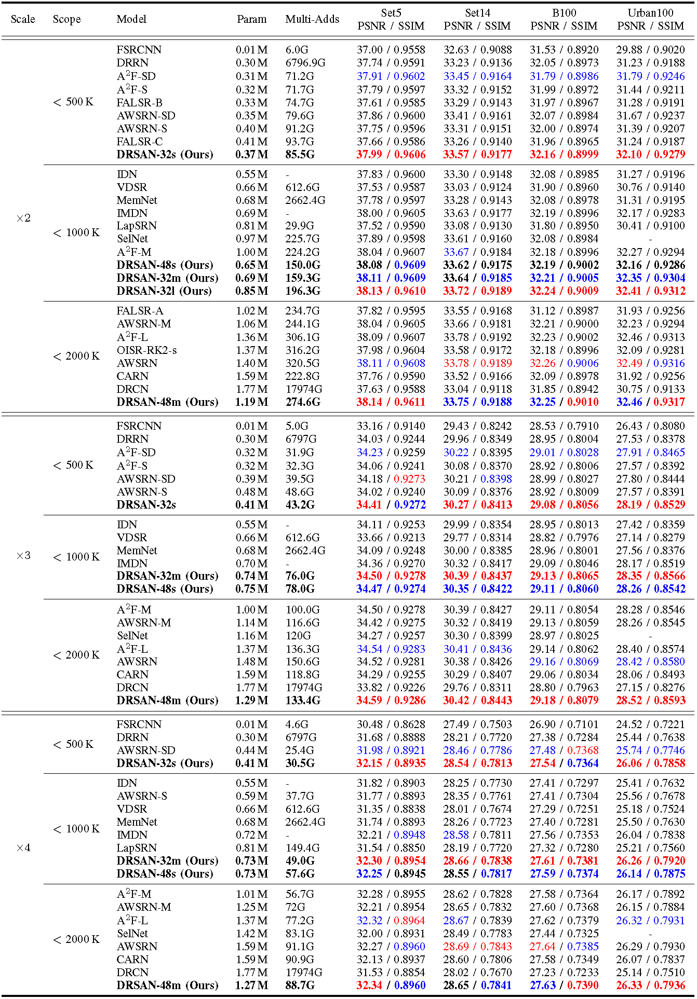
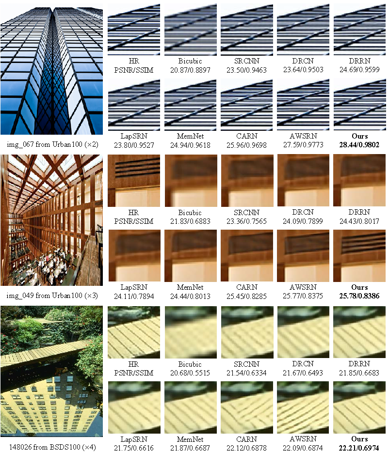

# DRSAN

# A Dynamic Residual Self-Attention Network for Lightweight Single Image Super-Resolution

Karam Park, Jae Woong Soh, and Nam Ik Cho
Accepted for publication as a regular paper in the IEEE Transactions on Multimedia

[Paper] https://arxiv.org/abs/2112.04488

## Environments
- Ubuntu 18.04
- [Tensorflow 1.8](http://www.tensorflow.org/)
- CUDA 9.0 & cuDNN 7.1
- Python 3.6

## Abstract

Deep learning methods have shown outstanding performance in many applications, including single-image superresolution (SISR). With residual connection architecture, deeply stacked convolutional neural networks provide a substantial erformance boost for SISR, but their huge parameters and computational loads are impractical for real-world applications. Thus, designing lightweight models with acceptable performance is one of the major tasks in current SISR research. The objective of lightweight network design is to balance a computational load and reconstruction performance. Most of the previous methods have manually designed complex and predefined fixed structures, which generally required a large number of experiments and lacked flexibility in the diversity of input image statistics. In this paper, we propose a dynamic residual self-attention network (DRSAN) for lightweight SISR, while focusing on the automated design of residual connections between building blocks. The proposed DRSAN has dynamic residual connections based on dynamic residual attention (DRA), which adaptively changes its structure according to input statistics. Specifically, we propose a dynamic residual module that explicitly models the DRA by finding the interrelation between residual paths and input image statistics, as well as assigning proper weights to each residual path. We also propose a residual self-attention (RSA) module to further boost the performance, which produces 3-dimensional attention maps without additional parameters by cooperating with residual structures. The proposed dynamic scheme, exploiting the combination of DRA and RSA, shows an efficient tradeoff between computational complexity and network performance. Experimental results show that the DRSAN performs better than or comparable to existing state-of-the-art lightweight models for SISR.

## Proposed Method

### Overall Structure
<p align="center"></p>

The framework of the proposed dynamic residual self-attention network (DRSAN). The upper figure shows that it consists of convolution layers (Conv), an upsampling network (Upsampler), and our basic building block DRAGs (dynamic residual attention groups). The lower figure describes the DRAG, which consists of an RB (residual block), a DRSA (dynamic residual self-attention), a DRM (dynamic residual module), a concatenation (Concat), and a 1x1 convolution, where the RB is structured as a cascade of Convs and PReLUs (parametric rectified linear units)

### Dynamic Residual Attention Group
<p align="center"></p>

The signal flow graph inside the DRAG, and the function of the n-th DRSA. The DRSA outputs the n-th residual feature (f_{n}) as a combination of f^{n}_{d} (addition of previous features with DRA) and alpha (RSA formed by the RB and sigmoid). The DRM determines the DRA that reflects the input properties.

## Experimental Results

### Model Analysis
<p align="center"></p>

The activation values of DRA in the 1st DRAG using different patches as input. Patches with similar DRA values are grouped. Patches are collected from images of benchmark datasets (x2).

<p align="center"></p>

The reconstructed images using DRA from different patches and their visualized difference maps. The difference map is calculated on the Y channel of the image and its original SR image. Patches are collected from images of benchmark datasets (x2).

### Quantitative Results
<p align="center"></p>

The results are evaluated with the average PSNR (dB) and SSIM on Y channel of YCbCr colorspace.
<font color="red">Red </font> color denotes the best results and <font color ="blue"> blue </font> denotes the second best.

### Visualized Results

<p align="center"></p>

## Guidelines for Codes

**Requisites should be installed beforehand.**

### Test

[Options]
```
python test.py --gpu [GPU_number] --model [Model_name] --scale [xN] --dataset [Dataset]

--gpu: The number designates the index of GPU to be used. [Default 0]
--model: 32s, 32m, 32l, 48s, 48m [Default 32s]
--scale: x2, x3, x4 [Default x2]
--dataset: Set5, Set14, B100 or Urban100 [Default Set5]

```
[An example of test codes]

```
python test.py --gpu 0 --model 32s --scale x2 --dataset Set5

```
